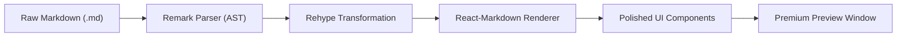

# Blueprint: High-Fidelity Markdown Preview Engine

This report outlines the technical strategy for building a "Premium Preview" window capable of transforming raw Markdown into the highly polished, interactive presentations seen in modern AI coding agents.

## 1. Technical Architecture

The engine should follow a **Pipeline-to-Component** architecture, moving from raw string data to an interactive React tree.



## 2. Core Technology Stack

| Layer | Recommended Technology | Purpose |
| :--- | :--- | :--- |
| **Parsing** | `remark-gfm` | Supports GitHub Flavored Markdown (tables, checklists). |
| **Transformation** | `rehype-react` | Maps AST nodes directly to custom React components. |
| **Styling** | `Tailwind CSS` | Rapid implementation of complex design tokens and glassmorphism. |
| **Animation** | `Framer Motion` | Layout transitions, entry animations, and interactive hover states. |
| **Code** | `Shiki` | High-accuracy syntax highlighting using VS Code themes. |
| **Diagrams** | `Mermaid.js` | Text-to-SVG rendering for flowcharts and sequence diagrams. |

## 3. High-Fidelity Features

### 3.1. Semantic Alert Interception
To achieve the "Premium" look for notes and warnings, implement a custom Remark plugin that identifies the `> [!TYPE]` syntax and maps it to a specialized Alert component.

```javascript
// Logic: If blockquote starts with [!NOTE], replace with <CustomAlert type="note" />
const AlertComponent = ({ type, children }) => (
  <div className={`p-4 rounded-xl border-l-4 glass-panel bg-${type}-500/10`}>
    <div className="flex items-center gap-2 font-bold uppercase text-sm mb-1">
      <Icon type={type} /> {type}
    </div>
    <div className="text-opacity-90">{children}</div>
  </div>
);
```

### 3.2. Glassmorphism UI (The "Ares" Look)
The polished feel is largely driven by depth and transparency. Use a shared CSS class for the preview container:

```css
.glass-panel {
  background: rgba(255, 255, 255, 0.05);
  backdrop-filter: blur(12px);
  border: 1px solid rgba(255, 255, 255, 0.1);
  box-shadow: 0 8px 32px 0 rgba(0, 0, 0, 0.37);
  border-radius: 1.5rem;
}
```

### 3.3. Mermaid.js Lazy Rendering
Diagrams should not block the initial page load. Use a dynamic component that wraps `mermaid.initialize` and renders the SVG inside a `useEffect` hook.

## 4. Implementation Steps

### Phase 1: The Markdown Pipeline
1.  Initialize a React environment with `react-markdown`.
2.  Install `remark-gfm` for table support.
3.  Implement `rehype-highlight` for initial code block parsing.

### Phase 2: Component Overrides
1.  Map `h1`, `h2`, `h3` to custom headers with anchor links and gradient text.
2.  Map `code` blocks to a custom `CodeBlock` component with a "Copy" button.
3.  Map `blockquote` to the `AlertComponent` described in section 3.1.

### Phase 3: The Polish Pass
1.  Apply **Framer Motion** `initial={{ opacity: 0, y: 10 }}` to every component to ensure a smooth "rise" effect on load.
2.  Implement a sticky **Table of Contents** that updates as the user scrolls.
3.  Add a **Smooth Scroll** behavior for internal links.

## 5. Security Considerations
*   **Sanitization**: Use `rehype-sanitize` to prevent XSS if the Markdown source is untrusted.
*   **Asset Isolation**: Ensure that Mermaid diagrams or external images do not have access to the parent window's DOM or local storage.

---
*Report generated for Davinci Labs by Antigravity*
