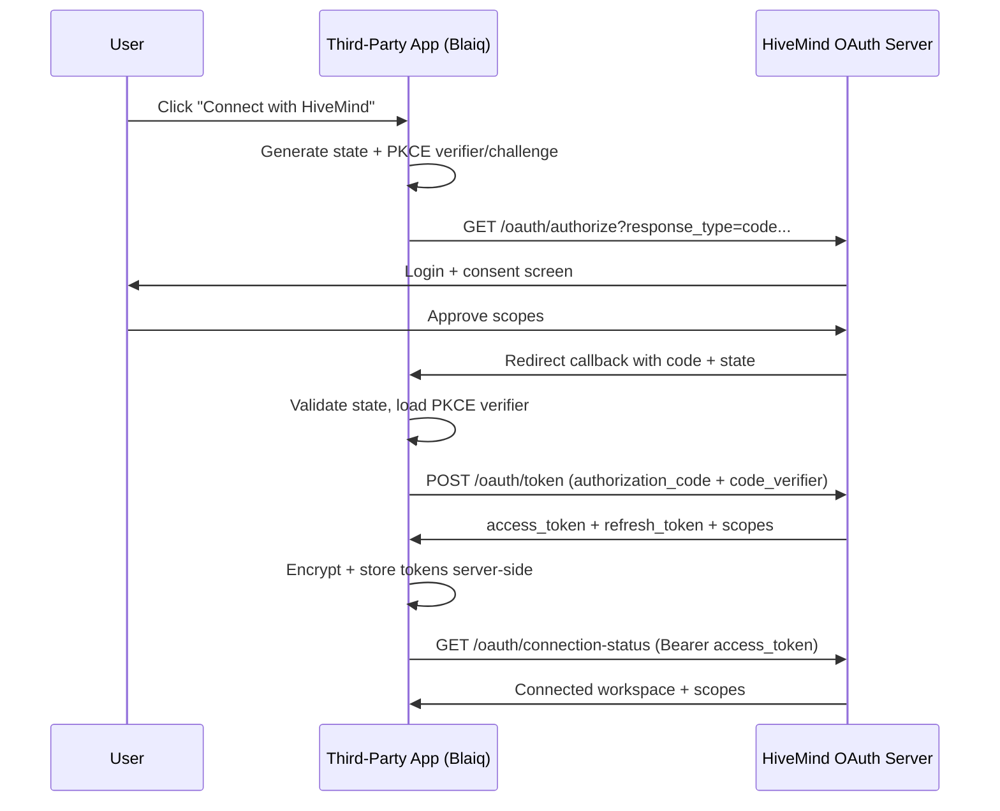

# HiveMind One-Click Connect Integration

## 1. Required HiveMind OAuth Endpoints

- `GET /.well-known/oauth-authorization-server`
- `GET /.well-known/oauth-protected-resource`
- `GET /oauth/authorize`
- `POST /oauth/authorize`
- `POST /oauth/token` (`authorization_code`, `refresh_token`)
- `POST /oauth/revoke`
- `GET /oauth/connection-status` (Bearer token status probe)

## 2. Partner App UX Contract

- Show single CTA: `Connect with HiveMind`
- Do not ask user for API keys
- Start OAuth 2.1 Authorization Code + PKCE on click
- Store refresh tokens only on server-side
- Show connected workspace, granted scopes, and disconnect action

## 3. Next.js Example Setup

1. Copy [`.env.example`](/Users/amar/HIVE-MIND/thirdpartyconnector/docs/.env.example) values to `thirdpartyconnector/examples/nextjs-app/.env.local`.
2. Ensure HiveMind OAuth client registration includes:
   - `client_id=hivemind-local-dev`
   - `redirect_uri=http://localhost:3401/api/hivemind/callback`
3. Start HiveMind core:
   - `cd core && npm install && npm run server`
4. Start example app:
   - `cd thirdpartyconnector/examples/nextjs-app && npm install && npm run dev`
5. Open `http://localhost:3401`.

## 4. Sequence Diagram

## 5. Error Handling Matrix

| Case | Symptom | Handling |
|---|---|---|
| Invalid `state` | callback has unknown state | reject callback, show reconnect prompt |
| PKCE mismatch | `/oauth/token` returns `invalid_grant` | clear transient state, restart connect |
| Redirect URI mismatch | `/oauth/token` returns `invalid_grant` | verify registered callback URI |
| Scope not allowed | `/oauth/authorize` or `/oauth/token` returns `invalid_scope` | request only client-allowed scopes |
| Refresh revoked/expired | `/oauth/token` refresh returns `invalid_grant` | force re-connect |
| Access token revoked | `/oauth/connection-status` returns `401` | attempt refresh once, then reconnect |

## 6. Security Minimums

- Use HTTPS in production for all OAuth and callback endpoints.
- Enforce strict redirect URI allowlist on HiveMind.
- Use PKCE `S256` for public/browser clients.
- Keep refresh tokens server-side only.
- Encrypt tokens at rest in partner backend.
- Use revocation on disconnect.
